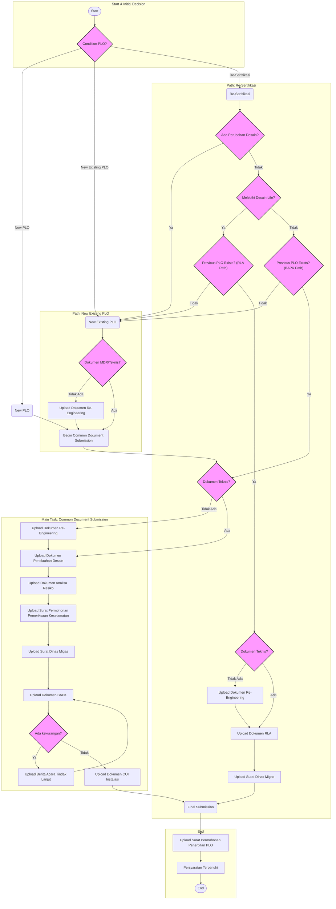

# Corrected Flowchart: RBI Apps Regulatory Compliance

This document provides a corrected and clarified version of the process flowchart, represented in Mermaid syntax for easy rendering and maintenance.

## 1. Process Summary

The flowchart outlines the document submission and validation process for obtaining a **Pemanfaatan Langsung Operasi (PLO)** permit. The process is divided into three main scenarios:

1.  **New PLO**: For new applications, requiring a full set of document submissions and validation checks.
2.  **New Existing PLO**: For existing facilities needing a new PLO, which first checks for existing technical documents before merging with the main submission workflow.
3.  **Re-Certification**: For renewing existing permits, with complex logic based on design changes, asset life, and the existence of a previous PLO.

All paths converge on a final submission and approval process.

## 2. Corrected Flowchart (Mermaid Syntax)

The following flowchart has been redrawn to improve clarity, reduce complexity, and merge redundant steps.

**Note on "Re-Certification" Logic**: The logic within the "Re-Certification" path, specifically after the "Melebihi Desain Life?" decision, remains ambiguous as depicted in the original diagram. The flowchart below represents that logic as closely as possible but in a cleaner format. **It is highly recommended to validate this specific part of the business process to ensure its accuracy.**

