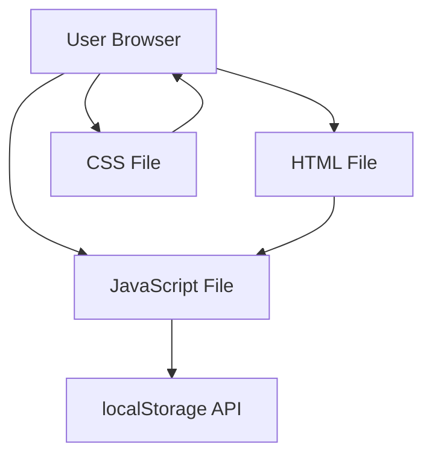
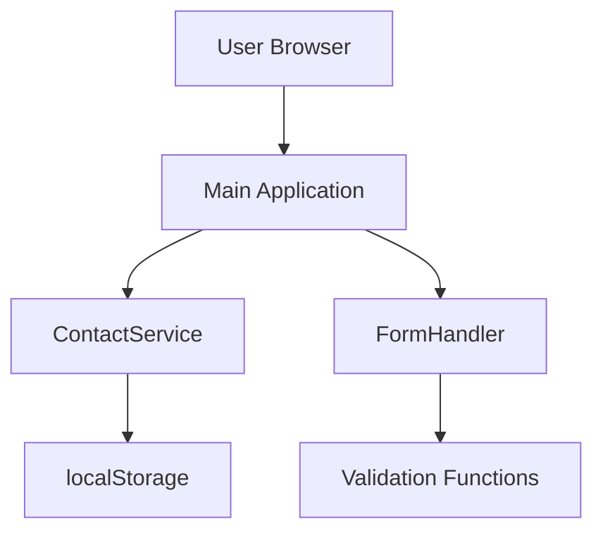
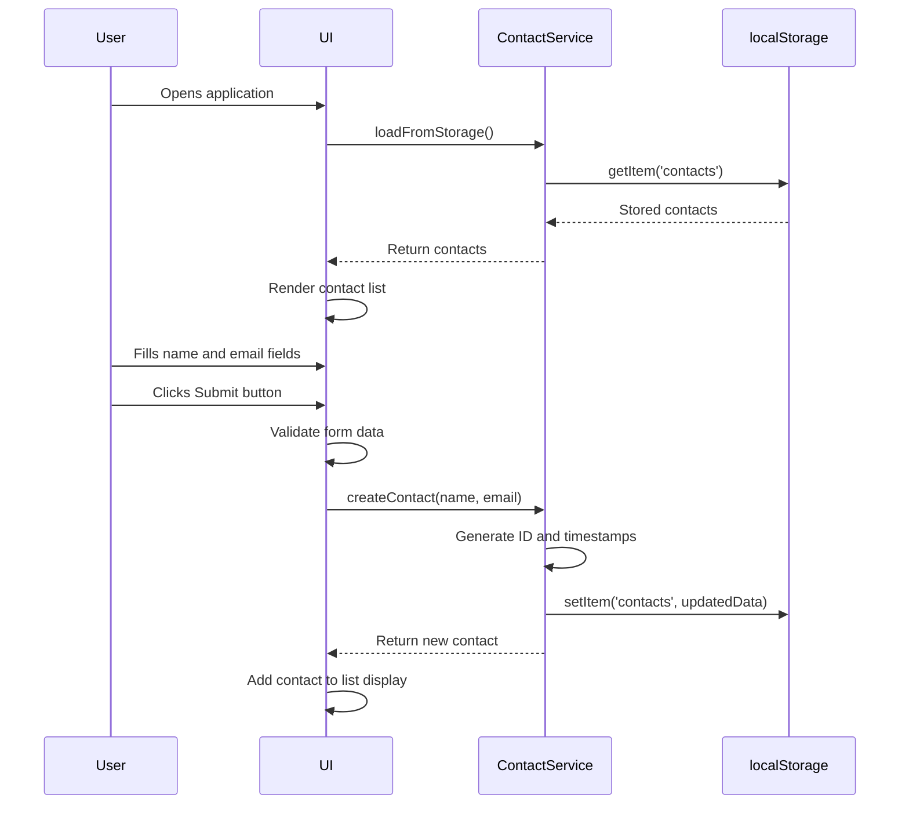
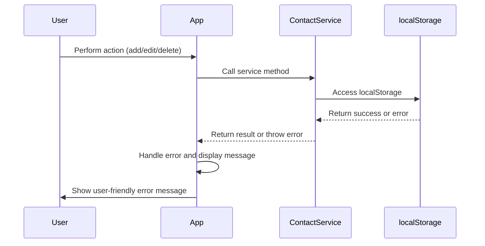

# Simple CRUD Web Application Fullstack Architecture Document

## Introduction

This document outlines the complete fullstack architecture for Simple CRUD Web Application, including backend systems, frontend implementation, and their integration. It serves as the single source of truth for AI-driven development, ensuring consistency across the entire technology stack.

This unified approach combines what would traditionally be separate backend and frontend architecture documents, streamlining the development process for modern fullstack applications where these concerns are increasingly intertwined.

### Starter Template or Existing Project

N/A - Greenfield project

### Change Log
| Date | Version | Description | Author |
|------|---------|-------------|--------|
| 2025-08-26 | 1.0 | Initial architecture document creation | Business Analyst |

## High Level Architecture

### Technical Summary

The Simple CRUD Web Application is a client-side only web application that runs entirely in the browser with no server dependencies. It uses HTML, CSS, and vanilla JavaScript to implement complete CRUD functionality for managing name and email entries. Data persistence is achieved through the browser's localStorage API, eliminating the need for any backend services. The architecture follows a single-page application (SPA) pattern with direct DOM manipulation, focusing on simplicity and immediate usability. The frontend is designed with responsive CSS using Flexbox/Grid for layout, ensuring compatibility across desktop and mobile devices. This architecture achieves all PRD goals by providing a lightweight, privacy-focused contact management solution that requires no server infrastructure.

### Platform and Infrastructure Choice

**Platform:** Client-side browser application
**Key Services:** None (runs entirely in browser)
**Deployment Host and Regions:** Any static file hosting or local file system

Rationale: The PRD specifically requires a client-side only application with no server dependencies. This approach ensures maximum simplicity, privacy (data never leaves the user's browser), and eliminates hosting costs. The application can run directly from a user's local file system or be hosted on any static file hosting service.

### Repository Structure

**Structure:** Monorepo with simple flat structure
**Monorepo Tool:** None (simple project structure)
**Package Organization:** 
- Single HTML file (index.html)
- CSS file (style.css)
- JavaScript file (main.js)

Rationale: The PRD specifies a simple application with no complex dependencies, making a flat file structure the most appropriate choice. This simplifies development and deployment while maintaining clear separation of concerns.

### High Level Architecture Diagram



### Architectural Patterns

- **Client-Side SPA:** Single-page application running entirely in browser - _Rationale:_ Eliminates server dependencies and provides immediate responsiveness
- **Direct DOM Manipulation:** Vanilla JavaScript DOM operations - _Rationale:_ Avoids framework overhead for simple CRUD operations
- **Module Pattern:** JavaScript code organization using modules - _Rationale:_ Provides clean code organization without complex build tools
- **localStorage Persistence:** Browser-based data storage - _Rationale:_ Meets privacy requirements and eliminates server needs

## Tech Stack

### Technology Stack Table

| Category | Technology | Version | Purpose | Rationale |
|----------|------------|---------|---------|-----------|
| Frontend Language | JavaScript | ES6+ | Core application logic | Required for browser execution, modern features improve code quality |
| Frontend Framework | Vanilla JS | Latest | DOM manipulation and interactivity | No framework needed for simple CRUD app, minimizes dependencies |
| UI Component Library | None | - | UI components | Custom components for maximum simplicity |
| State Management | Vanilla JS Objects | - | Application state | Built-in JavaScript objects sufficient for simple state |
| Backend Language | None | - | - | No backend required per PRD |
| Backend Framework | None | - | - | No backend required per PRD |
| API Style | None | - | - | No API needed, direct localStorage access |
| Database | localStorage | Browser-native | Data persistence | Meets privacy requirements, no server needed |
| Cache | None | - | - | Browser handles caching automatically |
| File Storage | None | - | - | Data stored in localStorage |
| Authentication | None | - | - | No authentication required per PRD |
| Frontend Testing | Manual Testing | - | UI verification | Simple app doesn't require extensive automated testing |
| Backend Testing | None | - | - | No backend to test |
| E2E Testing | Manual Testing | - | User flow validation | Simple app doesn't require extensive automated testing |
| Build Tool | None | - | - | No build process needed for simple JS/CSS/HTML |
| Bundler | None | - | - | No bundling needed for simple app |
| IaC Tool | None | - | - | No infrastructure to provision |
| CI/CD | None | - | - | No deployment pipeline needed |
| Monitoring | None | - | - | No server-side monitoring needed |
| Logging | Console | Browser-native | Debugging | Built-in browser console sufficient for development |
| CSS Framework | Vanilla CSS | Latest | Styling | No framework needed, custom CSS for control |

## Data Models

### Contact Entry

**Purpose:** Represents a single contact with name and email information.

**Key Attributes:**
- id: string - Unique identifier for the contact entry
- name: string - Contact's name
- email: string - Contact's email address
- createdAt: string - Timestamp when entry was created
- updatedAt: string - Timestamp when entry was last updated

```typescript
interface ContactEntry {
  id: string;
  name: string;
  email: string;
  createdAt: string;
  updatedAt: string;
}
```

**Relationships:**
- None (standalone entity)

## API Specification

This application does not require an API as it runs entirely client-side with direct localStorage access.

## Components

### Main Application Component

**Responsibility:** Orchestrates the entire application, managing the DOM and user interactions.

**Key Interfaces:**
- initialize(): void - Sets up the application on load
- render(): void - Updates the UI based on current state

**Dependencies:** 
- ContactService for data operations
- DOM manipulation functions

**Technology Stack:** 
- Vanilla JavaScript with module pattern
- DOM APIs for UI updates
- Event listeners for user interactions

### ContactService Component

**Responsibility:** Manages all contact data operations including CRUD operations and localStorage persistence.

**Key Interfaces:**
- createContact(name, email): ContactEntry - Creates a new contact
- getContacts(): ContactEntry[] - Retrieves all contacts
- updateContact(id, name, email): ContactEntry - Updates an existing contact
- deleteContact(id): void - Deletes a contact
- loadFromStorage(): ContactEntry[] - Loads contacts from localStorage
- saveToStorage(): void - Saves contacts to localStorage

**Dependencies:** 
- localStorage API
- UUID generation for IDs

**Technology Stack:** 
- Vanilla JavaScript
- localStorage Web API
- JSON for serialization

### FormHandler Component

**Responsibility:** Manages form interactions, validation, and user input processing.

**Key Interfaces:**
- validateForm(): boolean - Validates form data
- clearForm(): void - Clears form fields
- fillForm(contact): void - Populates form with contact data
- showError(field, message): void - Displays validation errors

**Dependencies:** 
- DOM elements for form fields
- Validation functions

**Technology Stack:** 
- Vanilla JavaScript
- DOM APIs for form manipulation
- Regular expressions for validation



## External APIs

This application does not require any external APIs as it runs entirely client-side with no server dependencies.

## Core Workflows



## Database Schema

Since this application uses localStorage for data persistence, the "schema" is represented as a JSON structure:

```json
{
  "contacts": [
    {
      "id": "string",
      "name": "string",
      "email": "string",
      "createdAt": "ISO timestamp",
      "updatedAt": "ISO timestamp"
    }
  ]
}
```

The contacts array is serialized to JSON and stored in localStorage under the key "contacts". Each contact entry follows the structure defined in the data model with:

- id: Unique identifier (UUID v4 recommended)
- name: Contact's name (string)
- email: Contact's email address (string)
- createdAt: ISO 8601 timestamp of when the entry was created
- updatedAt: ISO 8601 timestamp of when the entry was last updated

Data validation is performed in the JavaScript code before saving to localStorage to ensure:
- Name is not empty
- Email matches a valid email format
- All required fields are present

## Frontend Architecture

### Component Architecture

#### Component Organization

```
src/
├── components/
│   ├── ContactForm.js      # Form for creating/editing contacts
│   ├── ContactList.js      # Displays list of contacts
│   ├── ContactItem.js      # Individual contact display
│   └── Modal.js            # Modal dialog for editing
├── services/
│   └── ContactService.js   # Handles data operations
├── utils/
│   ├── validation.js       # Form validation functions
│   └── helpers.js          # Utility functions
├── styles/
│   └── main.css            # Global styles
└── main.js                 # Application entry point
```

#### Component Template

```javascript
// Basic component structure
class ComponentName {
  constructor(containerElement) {
    this.container = containerElement;
    this.state = {};
  }
  
  render() {
    // Render component UI
  }
  
  setState(newState) {
    this.state = { ...this.state, ...newState };
    this.render();
  }
}
```

### State Management Architecture

#### State Structure

```javascript
// Application state structure
const appState = {
  contacts: [
    {
      id: 'uuid-string',
      name: 'string',
      email: 'string',
      createdAt: 'ISO-timestamp',
      updatedAt: 'ISO-timestamp'
    }
  ],
  currentView: 'list' | 'edit' | 'create',
  editingContactId: 'uuid-string' | null,
  errors: {
    name: 'string' | null,
    email: 'string' | null
  }
};
```

#### State Management Patterns

- Single source of truth for all application data
- State updates trigger UI re-renders
- Component-level state for UI-specific data
- Service-level state for persistent data

### Routing Architecture

#### Route Organization

This is a single-page application with no traditional routing. Views are managed through:
- Main contact list view
- Edit contact modal
- Create contact form (part of main view)

#### Protected Route Pattern

Not applicable for this client-side only application.

### Frontend Services Layer

#### API Client Setup

Not applicable as there is no external API. Direct localStorage access is used.

#### Service Example

```javascript
class ContactService {
  static getAll() {
    const data = localStorage.getItem('contacts');
    return data ? JSON.parse(data) : [];
  }
  
  static save(contacts) {
    localStorage.setItem('contacts', JSON.stringify(contacts));
  }
  
  static create(contactData) {
    const contacts = this.getAll();
    const newContact = {
      id: this.generateId(),
      ...contactData,
      createdAt: new Date().toISOString(),
      updatedAt: new Date().toISOString()
    };
    contacts.push(newContact);
    this.save(contacts);
    return newContact;
  }
}
```

## Backend Architecture

This application does not have a backend as it runs entirely client-side with no server dependencies.

## Unified Project Structure

```
simple-crud-app/
├── index.html              # Main HTML file
├── css/
│   └── style.css           # All styles
├── js/
│   ├── main.js             # Application entry point
│   ├── components/
│   │   ├── ContactForm.js  # Form component
│   │   ├── ContactList.js  # List component
│   │   └── ContactItem.js  # Individual contact component
│   ├── services/
│   │   └── ContactService.js # Data management service
│   └── utils/
│       ├── validation.js   # Form validation functions
│       └── helpers.js      # Utility functions
├── README.md               # Project documentation
└── LICENSE                 # License information
```

## Development Workflow

### Local Development Setup

#### Prerequisites

```bash
# No special prerequisites needed
# Any modern web browser is sufficient
```

#### Initial Setup

```bash
# Clone or download the project
# No installation required
```

#### Development Commands

```bash
# Start development
# Simply open index.html in a web browser

# Run tests
# Manual testing through browser interactions

# Build for production
# No build process needed - files are ready to use
```

### Environment Configuration

#### Required Environment Variables

```
# No environment variables needed
# All configuration is handled in-browser
```

## Deployment Architecture

### Deployment Strategy

**Frontend Deployment:**
- **Platform:** Any static file hosting or local file system
- **Build Command:** None required
- **Output Directory:** Root directory
- **CDN/Edge:** Not applicable for localStorage-based app

**Backend Deployment:**
- **Platform:** None
- **Build Command:** None required
- **Deployment Method:** Not applicable

### CI/CD Pipeline

Not applicable for this client-side only application.

### Environments

| Environment | Frontend URL | Backend URL | Purpose |
|-------------|--------------|-------------|---------|
| Development | file:// or http://localhost | N/A | Local development |
| Production | Any static hosting | N/A | Live environment |

## Security and Performance

### Security Requirements

**Frontend Security:**
- CSP Headers: Not applicable for static files
- XSS Prevention: Basic HTML escaping in JavaScript
- Secure Storage: localStorage is sufficient for client-only data

**Backend Security:**
- Not applicable

**Authentication Security:**
- Not applicable

### Performance Optimization

**Frontend Performance:**
- Bundle Size Target: Minimal (3 files total)
- Loading Strategy: Direct file loading
- Caching Strategy: Browser default caching

**Backend Performance:**
- Not applicable

## Testing Strategy

### Testing Pyramid

```
Manual Testing
    |
    |
  Unit Tests (if added)
```

### Test Organization

#### Frontend Tests

```
tests/
├── unit/
│   └── contact-service.test.js
└── manual/
    └── test-plan.md
```

#### Backend Tests

Not applicable

#### E2E Tests

Manual testing of user flows:
1. Adding new contacts
2. Editing existing contacts
3. Deleting contacts
4. Data persistence between sessions

### Test Examples

#### Frontend Component Test

```javascript
// Example unit test for contact validation
describe('Contact Validation', () => {
  test('should validate correct email format', () => {
    expect(validateEmail('test@example.com')).toBe(true);
  });
  
  test('should reject invalid email format', () => {
    expect(validateEmail('invalid-email')).toBe(false);
  });
});
```

#### Backend API Test

Not applicable

#### E2E Test

Manual testing procedure:
1. Open index.html in browser
2. Enter name and email in form
3. Click submit
4. Verify contact appears in list
5. Close and reopen browser
6. Verify contact still exists

## Coding Standards

### Critical Fullstack Rules

- **Data Persistence:** Always use ContactService for localStorage operations
- **Form Validation:** Validate all user input before saving
- **Error Handling:** Handle localStorage quota exceeded errors gracefully
- **UI Updates:** Use consistent rendering functions for contact list updates
- **State Management:** Maintain single source of truth for contact data

### Naming Conventions

| Element | Frontend | Backend | Example |
|---------|----------|---------|---------|
| Components | PascalCase | - | `ContactForm.js` |
| Functions | camelCase | - | `validateEmail()` |
| Variables | camelCase | - | `contactList` |
| CSS Classes | kebab-case | - | `.contact-item` |
| Constants | UPPER_SNAKE_CASE | - | `MAX_CONTACTS` |

## Error Handling Strategy

### Error Flow



### Error Response Format

```typescript
interface AppError {
  code: string;
  message: string;
  timestamp: string;
}
```

### Frontend Error Handling

```javascript
class ErrorHandler {
  static handleStorageError(error) {
    if (error.name === 'QuotaExceededError') {
      this.showMessage('Storage full. Please delete some contacts.');
    } else {
      this.showMessage('An error occurred. Please try again.');
    }
  }
  
  static showMessage(message) {
    // Display error message to user
  }
}
```

### Backend Error Handling

Not applicable

## Monitoring and Observability

### Monitoring Stack

- **Frontend Monitoring:** Browser console for development debugging
- **Backend Monitoring:** Not applicable
- **Error Tracking:** Manual reporting
- **Performance Monitoring:** Browser developer tools

### Key Metrics

**Frontend Metrics:**
- Page load time
- JavaScript errors
- User interactions
- localStorage access performance

**Backend Metrics:**
- Not applicable

## Architect Checklist Results Report

### Executive Summary
- **Overall Architecture Readiness**: High
- **Critical Risks Identified**: None
- **Key Strengths**: 
  - Clear, simple architecture appropriate for the requirements
  - Well-documented components and interactions
  - Explicit technology choices with justifications
  - Good alignment with PRD requirements
- **Project Type**: Frontend-only project (client-side application with no backend)
- **Sections Evaluated**: All sections except backend-specific ones (as this is a frontend-only project)

### Section Analysis

| Section | Pass Rate | Notes |
|---------|-----------|-------|
| 1. Requirements Alignment | 100% (5/5) | All requirements from PRD are addressed |
| 2. Architecture Fundamentals | 100% (5/5) | Clear diagrams and component definitions |
| 3. Technical Stack & Decisions | 100% (5/5) | Specific technology choices with rationale |
| 4. Frontend Design & Implementation | 100% (6/6) | Comprehensive frontend architecture details |
| 5. Resilience & Operational Readiness | 80% (4/5) | Good error handling, but monitoring is minimal |
| 6. Security & Compliance | 80% (4/5) | Basic security addressed, but could be more comprehensive |
| 7. Implementation Guidance | 100% (5/5) | Clear coding standards and testing strategy |
| 8. Dependency & Integration Management | 100% (3/3) | No external dependencies to manage |
| 9. AI Agent Implementation Suitability | 100% (4/4) | Well-structured for AI agent implementation |
| 10. Accessibility Implementation | 60% (3/5) | Some accessibility considerations, but could be more comprehensive |

**Sections Skipped**: None (this is a frontend project, but no sections were inapplicable)

### Risk Assessment

#### Top 5 Risks by Severity

1. **Limited Monitoring & Observability**
   - **Risk**: Difficulty diagnosing issues in production
   - **Mitigation**: Implement basic logging mechanism and error reporting
   - **Timeline Impact**: Minimal - can be added during development

2. **Basic Security Implementation**
   - **Risk**: Potential XSS vulnerabilities with direct DOM manipulation
   - **Mitigation**: Implement proper HTML escaping and input sanitization
   - **Timeline Impact**: Minimal - can be addressed during development

3. **Incomplete Accessibility Implementation**
   - **Risk**: Application may not be usable by users with disabilities
   - **Mitigation**: Add comprehensive accessibility features and testing
   - **Timeline Impact**: Moderate - requires additional development time

4. **localStorage Quota Limitations**
   - **Risk**: Application may fail when storage quota is exceeded
   - **Mitigation**: Already addressed in error handling strategy
   - **Timeline Impact**: Minimal - already documented

5. **Browser Compatibility Issues**
   - **Risk**: Application may not work consistently across all browsers
   - **Mitigation**: Add comprehensive browser testing
   - **Timeline Impact**: Minimal - testing can be added

### Recommendations

#### Must-Fix Items Before Development
1. Enhance security measures with proper input sanitization and HTML escaping
2. Implement basic logging mechanism for debugging
3. Add comprehensive accessibility features

#### Should-Fix Items for Better Quality
1. Add automated testing framework for unit tests
2. Implement performance monitoring
3. Add browser compatibility testing matrix

#### Nice-to-Have Improvements
1. Add keyboard navigation support
2. Implement screen reader compatibility features
3. Add performance optimization techniques

### AI Implementation Readiness
- **Specific Concerns**: None - architecture is well-structured for AI agent implementation
- **Areas Needing Additional Clarification**: None
- **Complexity Hotspots**: None - the simple architecture avoids complexity

### Frontend-Specific Assessment
- **Frontend Architecture Completeness**: High - all necessary components and patterns are defined
- **Alignment Between Main and Frontend Architecture Docs**: N/A - this is a unified document
- **UI/UX Specification Coverage**: Good - covers essential frontend patterns
- **Component Design Clarity**: High - clear component structure and responsibilities

### Final Decision
**READY FOR DEVELOPMENT**: The architecture is comprehensive, properly structured, and ready for implementation. All critical elements are in place with only minor improvements suggested. The simple, client-side approach is well-aligned with the project requirements and constraints.