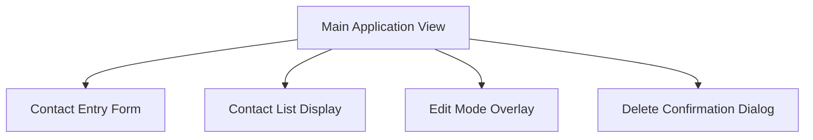
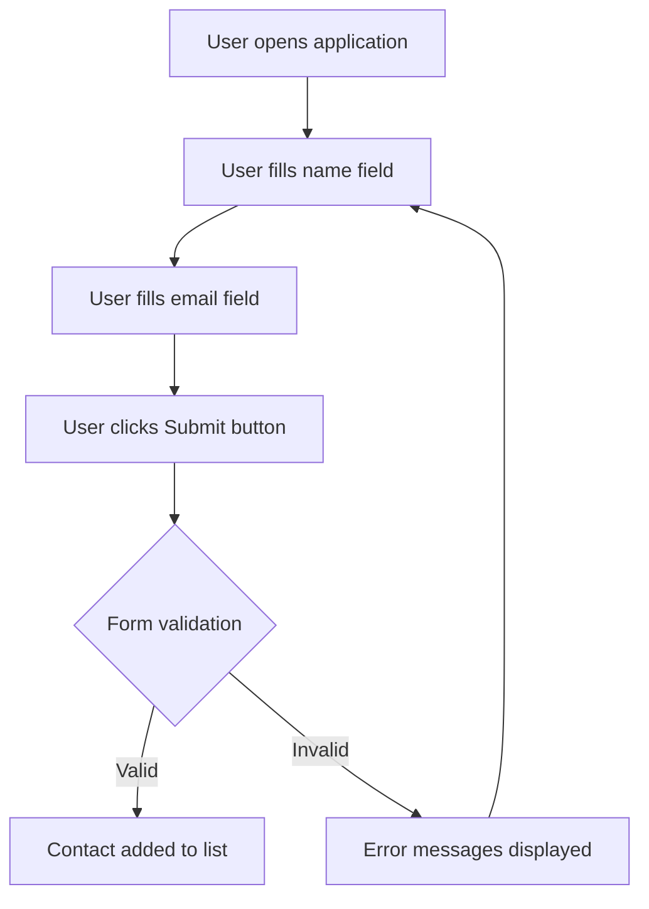
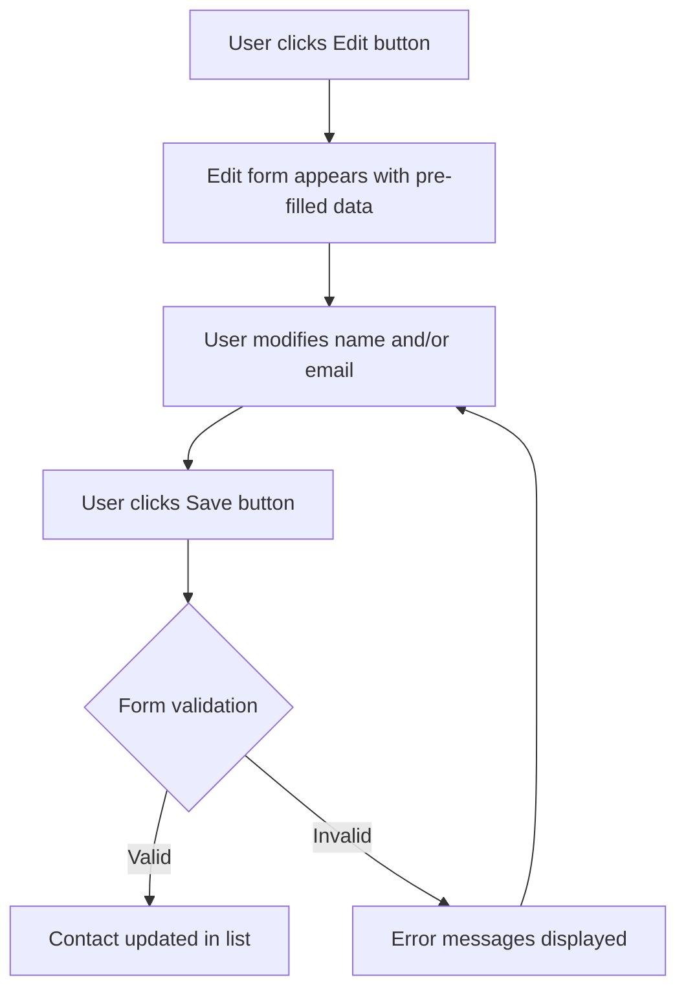
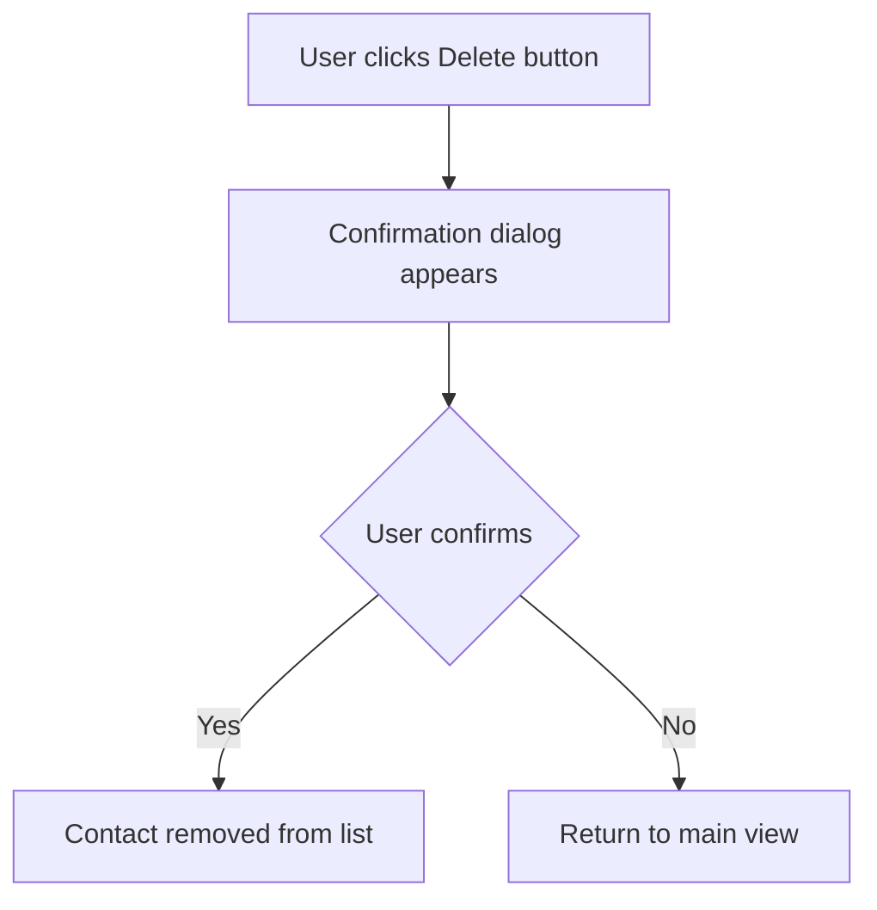

# Simple CRUD Web Application UI/UX Specification

## Introduction

This document defines the user experience goals, information architecture, user flows, and visual design specifications for Simple CRUD Web Application's user interface. It serves as the foundation for visual design and frontend development, ensuring a cohesive and user-centered experience.

### Overall UX Goals & Principles

#### Target User Personas

**Primary User:** Individuals and small teams who need a simple way to store and manage basic contact information (name and email pairs) locally in their browser, without dealing with server setup or cloud services.

**Characteristics:**
- Tech-savvy enough to run HTML files in their browser
- Values simplicity and ease of use over feature-rich applications
- Prefers local data storage for privacy reasons
- May be occasional users who need a straightforward tool for contact management

#### Usability Goals

- **Ease of learning:** New users can add their first contact entry within 30 seconds
- **Efficiency of use:** Users can perform all CRUD operations quickly without confusion
- **Error prevention:** Clear validation and confirmation for destructive actions like delete
- **Memorability:** Infrequent users can return without relearning how to use the application
- **Accessibility:** Users with disabilities can effectively use the application

#### Design Principles

1. **Clarity over cleverness** - Prioritize clear communication over aesthetic innovation
2. **Progressive disclosure** - Show only what's needed, when it's needed
3. **Consistent patterns** - Use familiar UI patterns throughout the application
4. **Immediate feedback** - Every action should have a clear, immediate response
5. **Accessible by default** - Design for all users from the start

### Change Log
| Date | Version | Description | Author |
|------|---------|-------------|--------|
| 2025-08-26 | 1.0 | Initial UI/UX specification creation | Business Analyst |

## Information Architecture (IA)

### Site Map / Screen Inventory

### Navigation Structure

**Primary Navigation:** Single-page application with no navigation between pages. All functionality is contained within one main view.

**Secondary Navigation:** Contextual actions available for each contact entry (Edit, Delete buttons).

**Breadcrumb Strategy:** Not applicable for single-page application.

## User Flows

### Add New Contact Flow

**User Goal:** Add a new name/email entry to the contact list.

**Entry Points:** User clicks in the empty name field of the entry form.

**Success Criteria:** New contact appears in the contact list with correct name and email.

**Edge Cases & Error Handling:**
- Empty name field: Display error message "Name is required"
- Invalid email format: Display error message "Please enter a valid email address"
- localStorage quota exceeded: Display error message "Unable to save contact - storage full"

**Notes:** Form should provide real-time validation feedback as users type.

### Edit Existing Contact Flow

**User Goal:** Modify an existing name/email entry in the contact list.

**Entry Points:** User clicks the Edit button next to a contact entry.

**Success Criteria:** Contact entry is updated with new name and/or email.

**Edge Cases & Error Handling:**
- Invalid email format during editing: Display error message "Please enter a valid email address"
- Empty name field: Display error message "Name is required"
- User cancels edit: Return to main view without changes

**Notes:** Edit form should appear as an overlay or inline form that pre-fills with existing data.

### Delete Contact Flow

**User Goal:** Remove an existing name/email entry from the contact list.

**Entry Points:** User clicks the Delete button next to a contact entry.

**Success Criteria:** Contact entry is removed from the contact list.

**Edge Cases & Error Handling:**
- User cancels deletion: Return to main view without changes
- localStorage error during deletion: Display error message "Unable to delete contact - please try again"

**Notes:** Confirmation dialog is essential to prevent accidental data loss.

## Wireframes & Mockups

### Design Files

**Primary Design Files:** This document contains conceptual layouts for key screens. Detailed visual designs would be created in a design tool like Figma or Sketch.

### Key Screen Layouts

#### Main Application View

**Purpose:** Primary interface for managing contacts with form for adding new entries and list for displaying existing entries.

**Key Elements:**
- Application header with title
- Contact entry form with name and email fields
- Submit button for adding new contacts
- List of existing contacts with edit/delete buttons
- Empty state message when no contacts exist

**Interaction Notes:** Form should provide real-time validation feedback. Contact list should update immediately when contacts are added, edited, or deleted.

**Design File Reference:** Conceptual layout in this document.

## Component Library / Design System

### Design System Approach

**Design System Approach:** Create a simple, consistent design system focused on usability and accessibility. Use a minimal set of components that can be easily implemented with vanilla CSS.

### Core Components

#### Form Field Component

**Purpose:** Standard input field for collecting user data with validation feedback.

**Variants:** 
- Text input for name field
- Email input for email field

**States:** 
- Default (empty)
- Filled
- Focused
- Error
- Disabled

**Usage Guidelines:** 
- Always include descriptive labels
- Provide clear error messaging below the field when validation fails
- Ensure adequate spacing between fields

#### Button Component

**Purpose:** Interactive element for triggering actions.

**Variants:** 
- Primary (Submit, Save)
- Secondary (Edit)
- Destructive (Delete)

**States:** 
- Default
- Hover
- Active
- Focus
- Disabled

**Usage Guidelines:** 
- Use clear, action-oriented text
- Ensure adequate click target size (minimum 44px)
- Provide visual feedback for all states

#### Contact Card Component

**Purpose:** Display individual contact entries in the list view.

**Variants:** 
- Default contact display
- Contact in edit mode

**States:** 
- Displaying name and email
- Showing edit/delete controls

**Usage Guidelines:** 
- Maintain consistent spacing and alignment
- Ensure edit/delete buttons are clearly visible but not overwhelming
- Consider truncation for long names or email addresses

## Branding & Style Guide

### Visual Identity

**Brand Guidelines:** Minimal branding with focus on functionality. The application should feel like a professional tool rather than a consumer product.

### Color Palette

| Color Type | Hex Code | Usage |
|------------|----------|-------|
| Primary | #007bff | Primary actions (Submit, Save buttons) |
| Secondary | #6c757d | Secondary actions (Edit buttons) |
| Accent | #28a745 | Success states, confirmations |
| Success | #28a745 | Positive feedback, confirmations |
| Warning | #ffc107 | Cautions, important notices |
| Error | #dc3545 | Errors, destructive actions |
| Neutral | #f8f9fa, #e9ecef, #343a40 | Text, borders, backgrounds |

### Typography

#### Font Families

- **Primary:** System UI fonts (BlinkMacSystemFont, -apple-system, "Segoe UI", Roboto, Helvetica, Arial, sans-serif)
- **Secondary:** Same as primary
- **Monospace:** SFMono-Regular, Menlo, Monaco, Consolas, "Liberation Mono", "Courier New", monospace

#### Type Scale

| Element | Size | Weight | Line Height |
|---------|------|--------|-------------|
| H1 | 2rem | 500 | 1.2 |
| H2 | 1.5rem | 500 | 1.2 |
| H3 | 1.25rem | 500 | 1.2 |
| Body | 1rem | 400 | 1.5 |
| Small | 0.875rem | 400 | 1.5 |

### Iconography

**Icon Library:** Simple Unicode symbols or basic SVG icons for essential actions.

**Usage Guidelines:** 
- Use consistent visual weight for all icons
- Ensure adequate spacing around icons
- Provide text alternatives for screen readers

### Spacing & Layout

**Grid System:** Simple 8px grid system for consistent spacing.

**Spacing Scale:** 
- XS: 4px
- S: 8px
- M: 16px
- L: 24px
- XL: 32px
- XXL: 48px

## Accessibility Requirements

### Compliance Target

**Standard:** WCAG 2.1 Level AA

### Key Requirements

**Visual:**
- Color contrast ratios: Minimum 4.5:1 for normal text, 3:1 for large text
- Focus indicators: Visible focus ring for all interactive elements
- Text sizing: Support for browser text resizing up to 200%

**Interaction:**
- Keyboard navigation: Full functionality available via keyboard
- Screen reader support: Proper semantic HTML and ARIA attributes
- Touch targets: Minimum 44px by 44px for interactive elements

**Content:**
- Alternative text: Descriptive alt text for all informative images/icons
- Heading structure: Proper hierarchical heading structure (H1, H2, etc.)
- Form labels: Every form field has an associated label

### Testing Strategy

**Accessibility Testing:** 
- Automated testing with tools like axe-core
- Manual keyboard navigation testing
- Screen reader testing with NVDA or VoiceOver
- Color contrast verification

## Responsiveness Strategy

### Breakpoints

| Breakpoint | Min Width | Max Width | Target Devices |
|------------|-----------|-----------|----------------|
| Mobile | 0px | 767px | Smartphones |
| Tablet | 768px | 1023px | Tablets |
| Desktop | 1024px | 1199px | Laptops, small desktop monitors |
| Wide | 1200px | - | Large desktop monitors |

### Adaptation Patterns

**Layout Changes:** 
- Single column layout on mobile
- Two column layout on tablet and desktop (form on left, list on right)
- Full width form and list on mobile

**Navigation Changes:** 
- All actions visible on all screen sizes
- Adequate spacing maintained between elements

**Content Priority:** 
- Form always visible
- Contact list scrolls vertically on smaller screens
- Edit/delete buttons remain accessible on all screen sizes

**Interaction Changes:** 
- Touch targets increase in size on mobile
- Hover states become active states on touch devices

## Animation & Micro-interactions

### Motion Principles

**Motion Principles:** 
- Subtle animations to provide feedback
- Consistent timing across all interactions
- Meaningful transitions that enhance usability
- Performant animations that don't block user interactions

### Key Animations

- **Form Validation Feedback:** Error messages fade in (Duration: 200ms, Easing: ease-out)
- **Contact Addition:** New contacts slide in with slight fade (Duration: 300ms, Easing: ease-out)
- **Contact Removal:** Deleted contacts fade out and collapse (Duration: 300ms, Easing: ease-in)
- **Button States:** Color transitions on hover and active states (Duration: 150ms, Easing: ease-in-out)
- **Form Submission:** Brief loading spinner on submit button (Duration: 1s, Easing: linear)

## Performance Considerations

### Performance Goals

- **Page Load:** Instantaneous (less than 100ms) since it's a client-side application
- **Interaction Response:** Immediate (less than 50ms) for all user actions
- **Animation FPS:** Maintain 60 FPS for all animations

### Design Strategies

**Performance Strategies:** 
- Minimize DOM elements and complexity
- Use efficient CSS techniques (transform, opacity) for animations
- Implement virtual scrolling for large contact lists
- Optimize form validation to avoid blocking the main thread
- Lazy load non-critical resources if any are added in future

## Next Steps

### Immediate Actions

1. Review this UI/UX specification with stakeholders for feedback
2. Create detailed visual designs in a design tool (Figma, Sketch, etc.)
3. Conduct usability testing with potential users
4. Refine designs based on feedback
5. Prepare for handoff to Design Architect for frontend architecture

### Design Handoff Checklist

- [x] All user flows documented
- [x] Component inventory complete
- [x] Accessibility requirements defined
- [x] Responsive strategy clear
- [x] Brand guidelines incorporated
- [x] Performance goals established

## Checklist Results

After reviewing the UI/UX specification against best practices:

**Overall Assessment:** READY

**Strengths:**
- Clear focus on simplicity and usability
- Comprehensive coverage of all user flows
- Strong accessibility considerations
- Well-defined design system
- Appropriate performance goals

**Areas for Improvement:**
- Could benefit from more detailed visual mockups
- Might need additional edge case handling for form validation
- Consider adding more specific guidelines for error messaging

**Recommendation:** The specification provides a solid foundation for development. The minimalist approach aligns well with the project goals and target users.